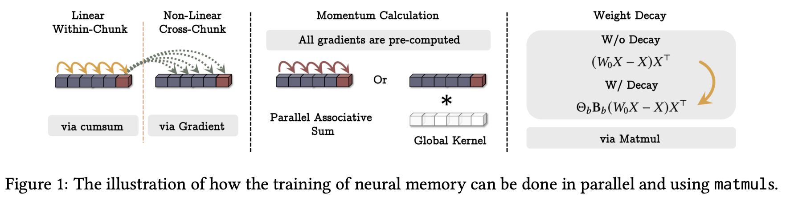

</img>

</img>

## Titans - Pytorch (wip)

Unofficial implementation of [Titans](https://arxiv.org/abs/2501.00663) in Pytorch. Will also contain some explorations into architectures beyond their simple 1-4 layer MLP for the neural memory module, if it works well to any degree.

## Appreciation

- [Eryk](https://github.com/sentialx) for sharing his early experimental results with me, positive for 2 layer MLP

## Install

```bash
$ pip install titans-pytorch
```

## Usage

```python
import torch
from titans_pytorch import NeuralMemory

mem = NeuralMemory(
    dim = 384,
    chunk_size = 64,
    pre_rmsnorm = True
).cuda()

seq = torch.randn(2, 1024, 384).cuda()
retrieved = mem(seq)

assert seq.shape == retrieved.shape
```

A transformer with the `MAC` configuration can be used as

```python
import torch
from titans_pytorch import MemoryAsContextTransformer

transformer = MemoryAsContextTransformer(
    num_tokens = 256,
    dim = 256,
    depth = 2,
    segment_len = 128,              # local attention window size
    num_persist_mem_tokens = 4,
    num_longterm_mem_tokens = 16,
)

token_ids = torch.randint(0, 256, (1, 1023))

loss = transformer(token_ids, return_loss = True) # (1, 1023, 256)
loss.backward()

# after much training

sampled = transformer.sample(token_ids[:, :4], 512)
```

## Experiments

```bash
$ pip install .[examples]
```

Then modify `train_mac.py` and run it to query nature

```bash
$ python train_mac.py
```

## Citations

```bibtex
@inproceedings{Behrouz2024TitansLT,
    title   = {Titans: Learning to Memorize at Test Time},
    author  = {Ali Behrouz and Peilin Zhong and Vahab S. Mirrokni},
    year    = {2024},
    url     = {https://api.semanticscholar.org/CorpusID:275212078}
}
```

```bibtex
@software{Kyrylov_Accelerated_Scan_2024,
    author  = {Kyrylov, Volodymyr},
    doi     = {10.5281/zenodo.10600962},
    title   = {Accelerated Scan},
    version = {0.1.2},
    year    = {2024}
}
```

```bibtex
@inproceedings{Yang2024GatedDN,
    title   = {Gated Delta Networks: Improving Mamba2 with Delta Rule},
    author  = {Songlin Yang and Jan Kautz and Ali Hatamizadeh},
    year    = {2024},
    url     = {https://api.semanticscholar.org/CorpusID:274598177}
}
```
